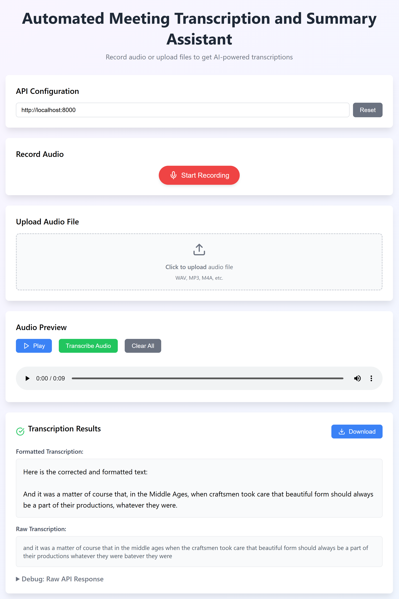

# 🗣️ End-to-End Speech-to-Text Meeting Transcription System

This project is a complete **AI-powered meeting transcription assistant** that converts audio recordings from meetings into accurate written notes using a custom-trained DeepSpeech2 model with **CTC loss** in TensorFlow.

It includes:

* 🎙️ Audio preprocessing & segmentation
* 🤖 DeepSpeech2-based ASR (Automatic Speech Recognition)
* 📋 LLM-based output formatting
* 🌐 React frontend + FastAPI backend



**Kaggle Notebook (Model training)**:
🔗 [End-to-End ASR with DeepSpeech2 & CTC Loss (TensorFlow)](https://www.kaggle.com/code/chaimaourgani/end-to-end-asr-with-deepspeech2-ctc-loss-tf)

---

## 🚀 Features

* ✅ Upload long meeting audio files
* ✅ Audio segmentation for efficient inference
* ✅ DeepSpeech2 ASR pipeline with CTC decoding
* ✅ Output post-processed with optional LLM formatting
* ✅ Clean React-based UI for testing the system

---

## 🧠 Project Structure

```
project-root/
│
├── frontend/                  # React web app for uploading & viewing results
│   └── src/
│       ├── App.js
│       └── index.js
│
├── backend/                   
│   ├── src/
│   │   ├── constants.py           # Constants, configs
│   │   ├── llm_formater.py        # Post-processing with LLM
│   │   ├── process_audio.py       # Audio preprocessing
│   │   └── setup_model.py         # Model loading
│   └── main.py                    # FastAPI entry point
│
├── artifacts/                  # Model weights, logs, etc.
├── requirements.txt            # Backend Python dependencies
├── README.md                   # You're here
```

---

## ⚙️ Setup Instructions

### 🔧 Backend

```bash
cd backend/
python -m venv venv
source venv/bin/activate  # or venv\Scripts\activate on Windows
pip install -r requirements.txt
uvicorn main:app --reload
```

> Make sure to place your trained `.keras` model and `vocab.json` in the appropriate paths (`artifacts/` or `src/`).

### 🖼️ Frontend

```bash
cd frontend/
npm install
npm start
```

---

## 📦 API Usage

### POST `/transcribe/`

Upload a WAV audio file to get the transcription.

#### Example with `curl`:

```bash
curl -X POST "http://localhost:8000/transcribe/" \
  -H "accept: application/json" \
  -H "Content-Type: multipart/form-data" \
  -F "file=@meeting.wav"
```

---

## 📈 Model Overview

The ASR model is based on **DeepSpeech2**, using:

* **CTC loss**
* **Bidirectional RNNs**
* **Custom character vocabulary**
* Trained on **LibriSpeech-like data**
  *(See the [Kaggle notebook](https://www.kaggle.com/code/chaimaourgani/end-to-end-asr-with-deepspeech2-ctc-loss-tf) for details)*

---

## 🔍 Future Work

* 🔁 Real-time streaming support
* 📄 LLM summarization of transcripts
* 📊 Analytics dashboard for meetings
* 🌍 Multilingual support

---

## 🧑‍💻 Author

**Chaimaâ Ourgani**
📫 [chaimaaorg.github.io/portfolio](https://chaimaaorg.github.io/portfolio/)
🔗 [LinkedIn](https://www.linkedin.com/in/chaima%C3%A2-ourgani-65a422273/)

---

## 📜 License

MIT License – use freely and responsibly.
